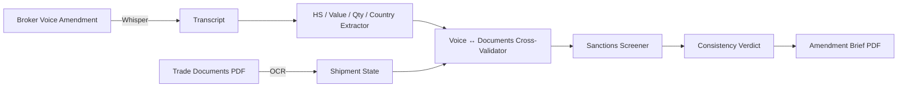
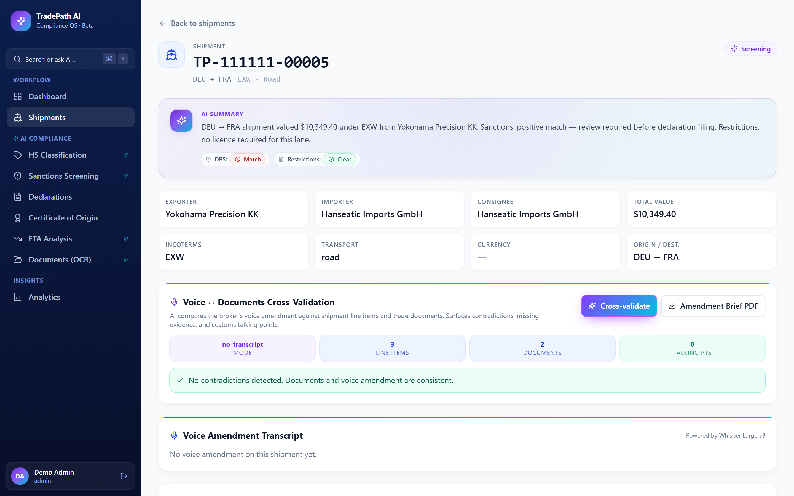

# TradePath AI

> Cross-checks a customs broker's voice amendment against shipment line items + trade documents in seconds and surfaces sanctions matches before declaration filing — replacing the manual reconciliation that delays cross-border shipments by hours.

<p align="center">
  
</p>

---

## The problem

Customs brokers and freight forwarders amend shipments verbally — over the phone with the shipper — and then have to update the declaration before filing with the customs authority. A typo on a HS code, a missing licence reference, a sanctions hit on the consignee: each one delays the shipment by hours and triggers re-work. The voice amendment and the document state drift apart constantly.

## What this does

TradePath ingests the broker's voice amendment (Whisper Large v3) plus the shipment's line items + trade documents (Azure Document Intelligence OCR). It runs cross-validation between voice and documents, flags HS-code revisions, declared-value drift >10 %, quantity-unit mismatches, country-of-origin revisions, and surfaces sanctions positive matches against the screening list. A consistency verdict ("✓ No contradictions detected") or a flagged contradiction list is rendered in the UI. The amendment brief PDF goes to the broker for filing.

## Real-world scenario

> A customs broker dictates a voice amendment for shipment TP-111111-00005 (DEU → FRA, EXW, $10,349.40 from Yokohama Precision KK). TradePath returns: **AI SUMMARY: Sanctions positive match — review required before declaration filing. Restrictions: no licence required for this lane.** Cross-validation: 3 line items, 2 documents, 0 talking points unresolved. Verdict: *"✓ No contradictions detected. Documents and voice amendment are consistent."* Powered by Whisper Large v3. The broker downloads the amendment brief PDF and files cleanly.

## Why it saves time

| Metric | Manual approach | TradePath AI | Improvement |
|---|---|---|---|
| Per-amendment reconciliation | ~30 min per shipment | **seconds for the AI pass + minimal broker review** | qualitative |
| Sanctions catch | manual list lookup | inline positive-match flag with reasoning | systematic |
| HS-code drift | rarely caught | extracted from voice + cross-validated | systematic |

## Key features

- **Whisper Large v3 voice amendment ingestion**.
- **HS-code extractor** from voice.
- **Declared-value drift detector** (>10 % flagged).
- **Country-of-origin revision detector**.
- **Quantity-unit mismatch detector**.
- **Sanctions screening** inline (positive match flagged before filing).
- **Voice ↔ Documents Cross-Validation** verdict panel.
- **Amendment brief PDF** with line-by-line cross-check.
- **AI compliance sidebar** with HS Classification / Sanctions Screening / Certificate of Origin / FTA Analysis / Documents (OCR) workflow shortcuts.

## How it works

The non-obvious decision was to **make the voice amendment its own first-class object**, not just a note attached to a shipment. The amendment record carries the verbatim transcript, the extracted HS code / value / quantity / country, and the per-axis cross-check verdict. That means an audit trail of "what the broker said vs what the documents said" exists forever — a regulatory must-have when customs disputes arise weeks after filing.

## Architecture



## Screenshots

### Cross-validation done


### Cross-validation running



### Shipments list


### Shipments filtered (blocked)


### Sanctions screening


### Documents OCR


### HS classification


### Command palette (AI-filtered)


## Stack

- **Backend:** `fastapi`, `sqlalchemy` + PostgreSQL, `openai` SDK via DeepInfra (Whisper), `azure-ai-documentintelligence` (trade doc OCR), `reportlab` (amendment brief PDF), prompt-injection sanitization on all AI calls.
- **Frontend:** `react` + `vite` + `react-router-dom`, `@tanstack/react-query`, `cmdk` for the ⌘K palette.
- **Infra:** Docker Compose (api, worker, postgres, redis, frontend).

## Quick start

```bash
git clone https://github.com/wissalbenothmen/tradepath-ai.git
cd tradepath-ai
cp .env.example .env   # DEEPINFRA_API_KEY, OPENAI_API_KEY, AZURE_DI_*, JWT_SECRET
docker compose up -d
# API: http://localhost:8007/docs — UI: http://localhost:5007
```

## Limitations

- **HS classification is voice-extract + cross-check.** Direct lookup against the WCO HS 2022 master is loaded by the customer; the public set ships as a starter.
- **EU + US sanctions lists today.** UK / UN / Swiss / Japanese lists need separate adapters.
- **English broker amendments only.** Multilingual brokers need re-tuned regex sets.
- **No EDI integration.** Amendments flow through TradePath manually or via API; direct customs EDI is roadmap.

## Roadmap

- [ ] UK / UN / Swiss / Japan sanctions lists.
- [ ] WCO HS 2022 master subscription.
- [ ] Multilingual broker amendment support.
- [ ] EDI integration with major national customs authorities.
- [x] Voice ↔ documents cross-validation.
- [x] Prompt-injection sanitization.
- [x] Sanctions positive-match flagging.

## What I learned

- **Treating the voice amendment as a first-class object** is what made TradePath defensible in a customs dispute weeks later.
- **Sanctions positive-match flagging on the same screen as the AI summary** stops a filing that would otherwise have been submitted.

## License

Released under the [MIT License](LICENSE).

## Acknowledgements

Built with [FastAPI](https://fastapi.tiangolo.com/), [SQLAlchemy](https://www.sqlalchemy.org/), [React](https://react.dev/), [Whisper](https://github.com/openai/whisper) via [DeepInfra](https://deepinfra.com/), [Azure Document Intelligence](https://learn.microsoft.com/en-us/azure/ai-services/document-intelligence/), and [ReportLab](https://www.reportlab.com/).
